## 1. Analizar el archivo "requirements.txt"
Como se puede ver en la siguiente imagen, este es el archivo requirements.txt que se puede llegar a ver en el repositorio clonado

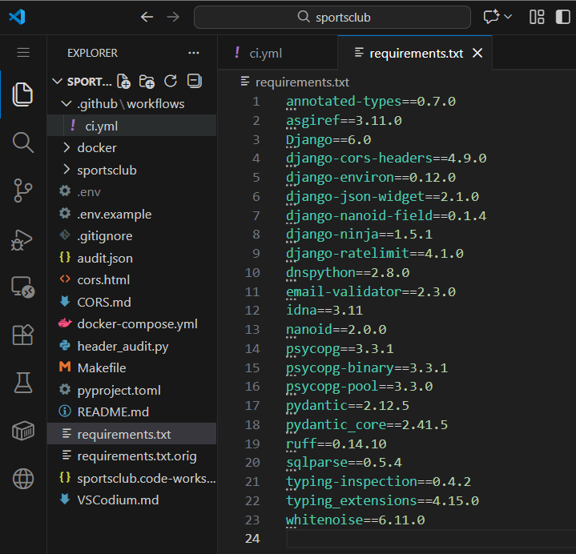

El archivo requirements.txt del proyecto contiene las dependencias necesarias para ejecutar la aplicación, pero presenta varios problemas desde el punto de vista de seguridad y buenas prácticas.

### Problemas

- No hay hashes y tampoco se esta aplicando pip-compile, que va de la mano con no usar hashes.

    Pero tambien quiere decir que no tiene dependencias indirectas bloqueadas, no garantia reprodución completa ni tampoco sigue el estandar moderno de "lock file"

- Dependencias de desarrollo se encuentran mezcladas con producción

- No hay separación entre input file y lock file

## 2. Nuevo requirements.txt

### Solucionar problemas

1. Crear un entono virtual y activarlo:

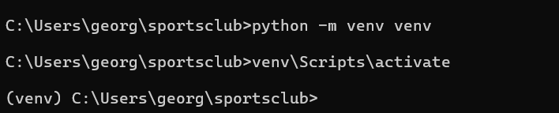

2. Instalar pip-tools para poder usar el comando pip-compile:

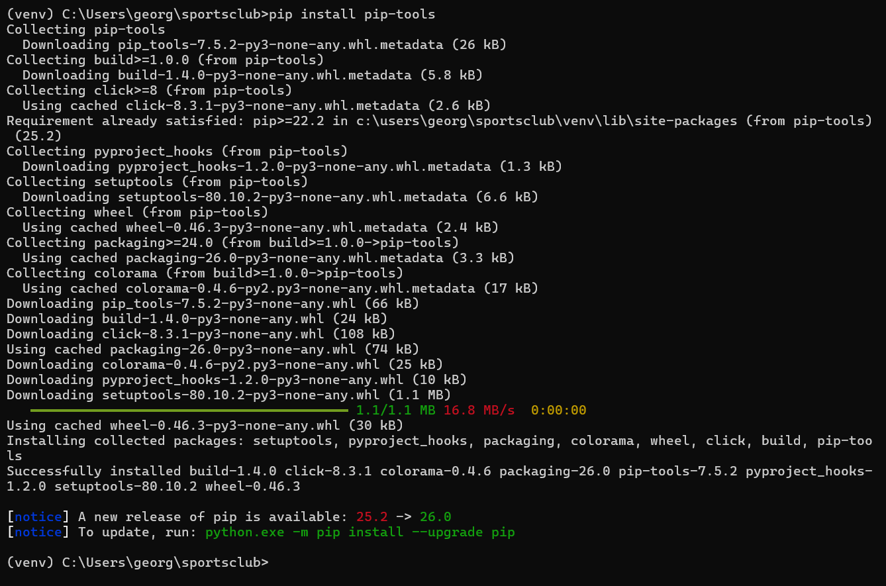

3. Se ha modificado el nombre del original para poder crear el nuevo txt sin conflictos:

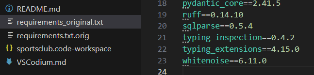

4. Crear el archivo "requirements.in" para generar el nuevo "requirements.txt" mejorado:

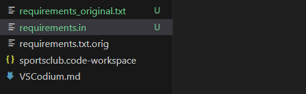

5. Contenido del .in a partir del .txt original :

    Como se puede ver no hay lo mismo, porque en el requirements.txt original habia dependencias directas, que el propio desarollador decidió instalar, como tambien dependencias indirectas, las que de manera automatica se instalan porque se necesitan.

    En el fichero .in solamente se tiene que poner las dependencias directas, siendo esto lo más limpio posible y  mantenible, por lo que tiene que ser simple. (En el .in solo contiene lo que el desarrollador decide instalar.)

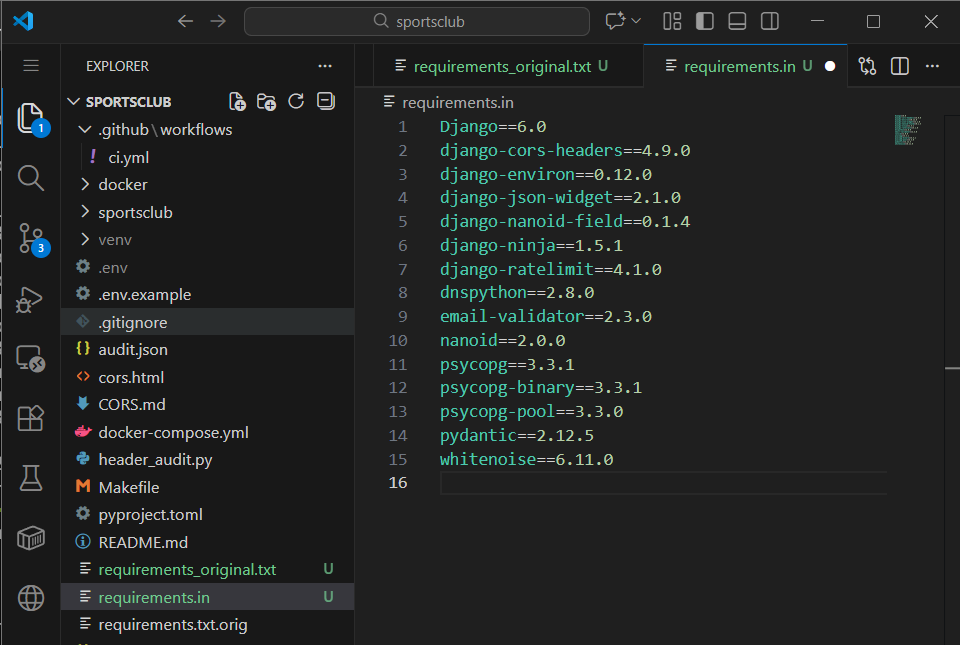 (requirements.in = un input file)

    Hay que tener en cuenta tambien que las dependencias indirectas se añaden automaticamente con el "pip-compile", por lo que estarán en el nuevo .txt junto con sus hashes.

    Por lo que las indirectas como asgiref, sqlparese o typing_extensions, no se añaden porque estas se van a resolver al ejecutar pip-compile

#### ¿Dependencias directas vs indirecta?

Para poder entnder claramente lo que se tiene que poner el el archivo .in, neceario hacer varias aclaraciones antes. Las directas son las que el propio desarrollador escribió a mano, no porque la necesite una libreria, se usan dentro del proyecto como por ejemplo para importandolas y se podrias decir que es un librería "principal" del proyecto como en este caso: Django, djang-ninja, psycopg, etc.

Las depedencias directas, son las que se deciden intalar y las indirectas se tratan de aquellas que se tiene que hacer sus instalación por otra dependencia que las necesita (se añaden automaticamente ejecuando "pip-compile").

6. Generar automaticamente el nuevo "requirements.txt":

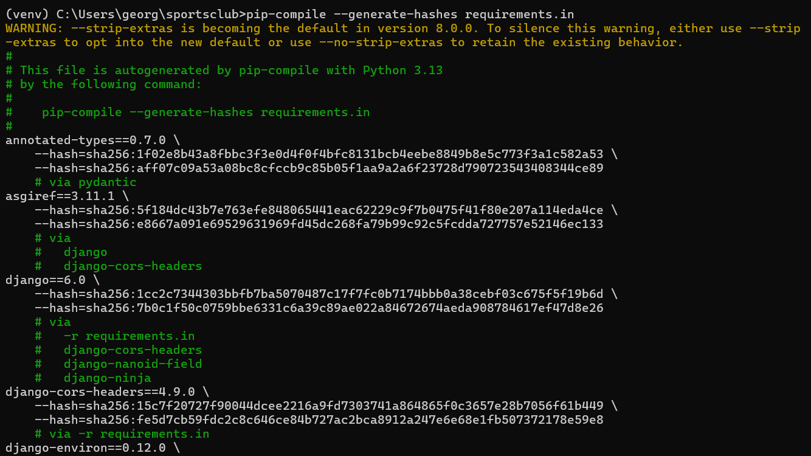
(nuevo requirements.txt generado = lock file)

    pip-compile --generate-hashes requirements.in

Se puede llegar a ver que efectivamente se ha creado un nuevo requirements.txt junto con los hashes corespondientes mencionados anterioramente.

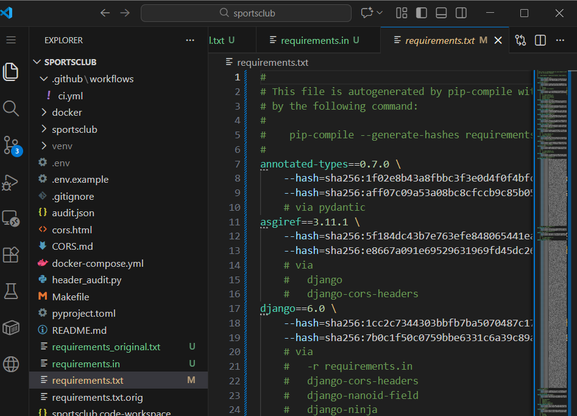

Para continuar con la solución de los problemas, en la versión mejorada y dentro de un nivel un poco más avanzado, que no se pide pero si aplica en la creación de una mejor versión de requirements.txt originla del principio, se trata de tener un archivo "requirements-dev.in" y un "requirements-dev.txt".

Siendo la forma correcta para solucionar el problema de las dependencias de desarrollo que se encuentra mezcladas con producción, creando un fichero separado para desarrollo.

7. Crear el fichero "requirements-dev.in" : 

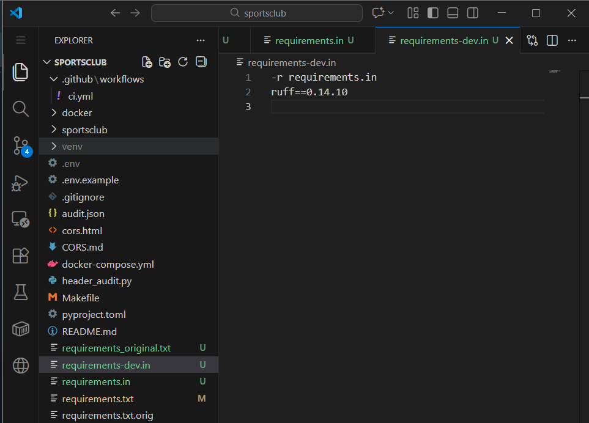

    -r requirements.in 

It is to inherit all production dependencies so as not to have to duplicate them.

    ruff==0.14.10

Este "ruff" es un linter, y no se tiene que instalar en produción por ese motivo la serparación y la creación de dev.in.

Igual que en el paso anterior se va ha generar de manera automatica su -dev.txt corespondiente usando el siguiente comando 

    pip-compile --generate-hashes requirements-dev.in

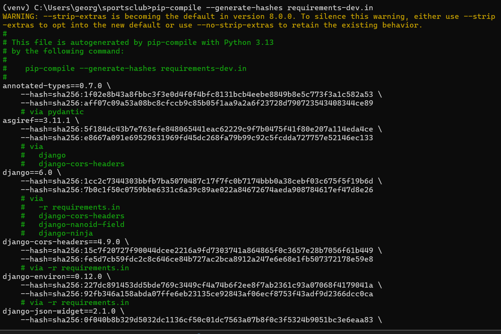

Como se puede ver en la siguiente imagen, se ha creado el archivo -dev.txt correctamente.

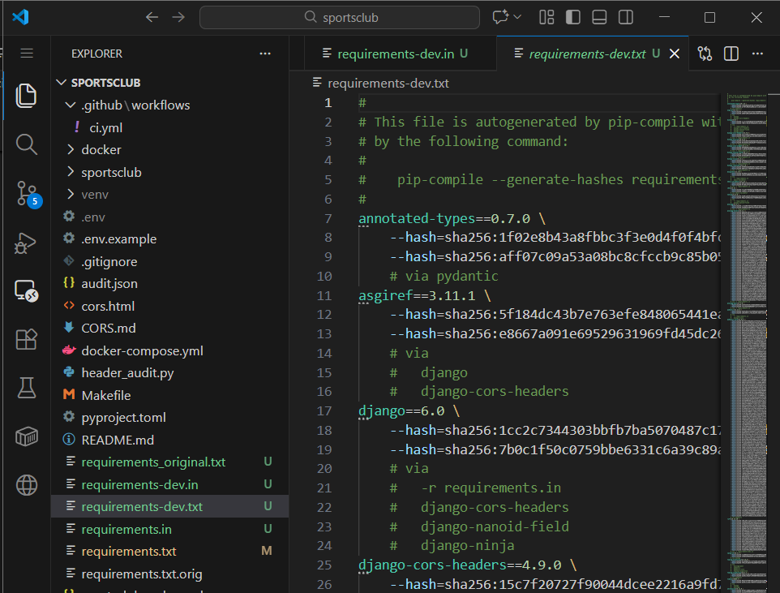

### Concluciones 

Como ya se puede ver al final el la versiones mejoradas tanto en requeriments.txt como en requeriments-dev.txt, se han implemntado lo siguiente: 

- El uso de hashes.
- El bloqueo de dependencias indirectas.
- La separación de desarrollo y producción.
- Se ha podido obtener una cierta reproducibilidad con la generación automatica.
- Reducing the risk of supply chain attacks

### Scenarios that are prevented

Con las correciones aplicadas en los apartados anteriores se ha llegado a la conlucion de que se puede llegar cubrir escenarios como por ejemplo los siguientes:

1. Las instalaciones que se hace de manera inconcientes, que se podrias decir a causa del factor humano.

2. En el caso de que se den cambios incesperados, en relación a las dependencias indirectas.

3. No hay o se reducen las "contaminaciones" con las herramienatas de desarrollo.

4. Si se da que un atacante publica un paquete con el mismo nombre y versión, el hecho de no usar pip-compile se podrias aplicar perfectamente en el proyecto, por eso mismo esl caso de paqueste maliciosos reduce bastante.

#### Production Best Practices

Comando a ejcutar en producción para aplicar el "requirements.txt"

    pip install --no-deps --require-hashes -r requirements.txt

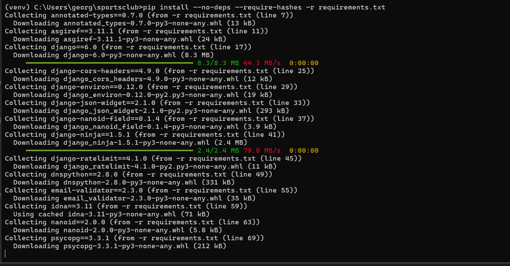
Comando para aplicar 
"requirements-dev.txt"
    
    pip install --no-deps --require-hashes -r requirements-dev.txt

Hay que decir que aunque haya imagenes aplicados estos comados, se estan haciendo desde el local, se hace la instalación exacta de las verisiones y hashes de los .txt. 

Clarifying that if these versions are already in my virtual environment, nothing will happen in my case, in the event that one is missing, it will install it but they are simply tests to see its use and application.

### Subir cambios en el respositorio

Con "git status" se puede ver los archivos cambiado: 

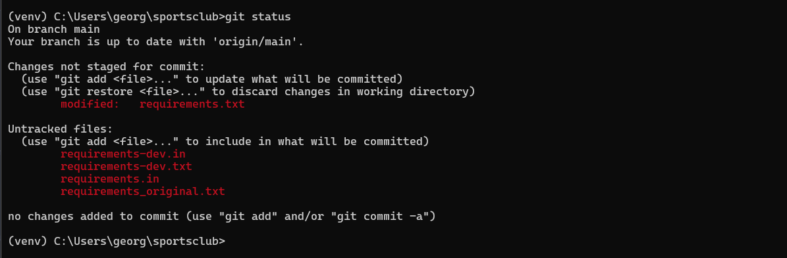

Por lo que se va ha ejecutar "git add ." para aplicar los cambio y comoprobar con status.

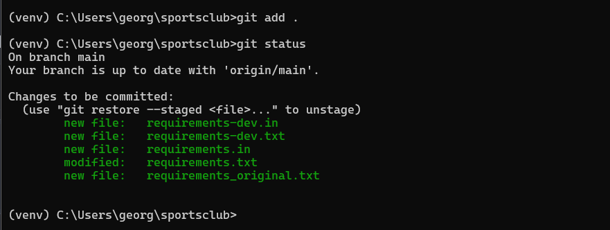

La creación de un commit:

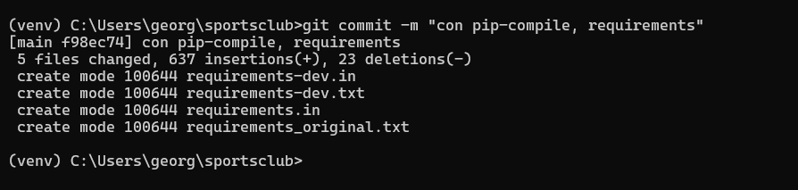

Quedando la subidad de este : 

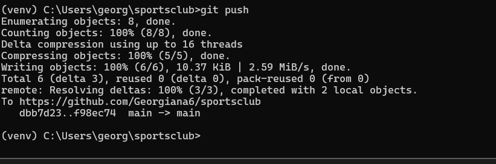

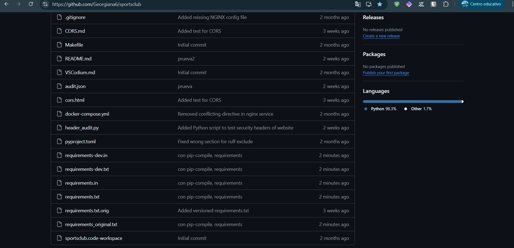

When checking the existence of failures in the upload on GitHub , the following was seen: 

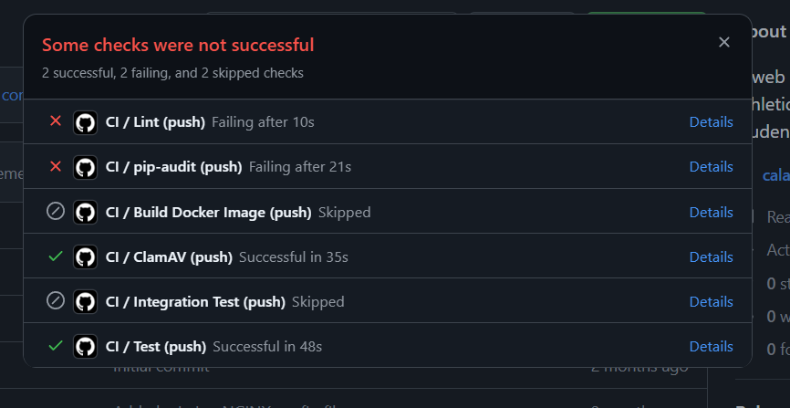

Eso quiere decir que pip-audit ha detectado vulnerabilidades en las dependencias y el Lint es porque Ruff ha encontrado errores de estilo o de formato, puede ser normal por que antes se tenia mezclado en producción y el pipeline sigue ejecutando Ruff, tambien puede ser por errores de estilo, por lo que se tendrá que ver detalladamente más adelante.